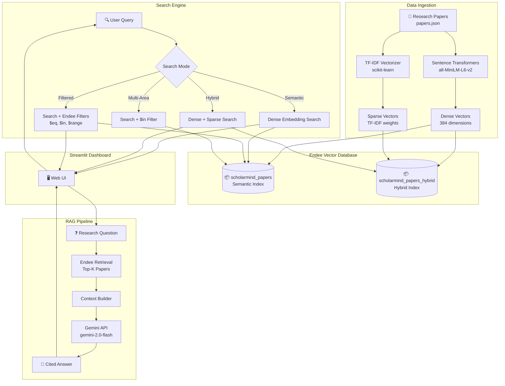

# 🎓 ScholarMind — AI-Powered Research Paper Discovery & QA Engine

> **Semantic Search • Hybrid Search • Filtered Queries • RAG Q&A**  
> Powered by [Endee](https://github.com/endee-io/endee) — High-Performance Open Source Vector Database

ScholarMind is an intelligent research paper discovery system that enables researchers to find relevant academic papers using **semantic understanding**, not just keyword matching. It leverages **Endee** as its core vector database to deliver lightning-fast similarity search across a corpus of AI/ML research papers, with a beautiful Streamlit dashboard.

---

## 🎯 Problem Statement

Researchers spend enormous time finding relevant academic papers. Traditional keyword search misses semantically similar papers, and there's no easy way to ask natural language questions about a body of research. ScholarMind solves this by combining vector similarity search with LLM-powered question answering.

---

## 🏗️ System Architecture



---

## ⚡ How Endee Is Used

ScholarMind utilizes **every major Endee feature** as its core vector database:

| Endee Feature | How It's Used | Code Location |
|---|---|---|
| **`create_index()`** | Creates semantic & hybrid indexes with cosine space, INT8 precision | `ingest.py` |
| **`create_index(sparse_dim=)`** | Creates hybrid index supporting both dense & sparse vectors | `ingest.py` |
| **`index.upsert()`** | Batch-inserts 45 paper vectors with metadata & filter fields | `ingest.py` |
| **`index.query(vector=)`** | Semantic similarity search using dense embeddings | `search.py` |
| **`index.query(sparse_indices=)`** | Hybrid search combining dense embeddings + TF-IDF sparse vectors | `search.py` |
| **Filter: `$eq`** | Exact match filtering by paper category or research area | `search.py` |
| **Filter: `$in`** | Multi-value filtering across multiple research areas | `search.py` |
| **Filter: `$range`** | Year-range filtering (normalized to 0-999) | `search.py` |
| **`index.describe()`** | Displays index statistics in the dashboard | `app.py` |
| **`client.delete_index()`** | Cleans up existing indexes during re-ingestion | `ingest.py` |

### Two-Index Architecture

```
scholarmind_papers        → Semantic search + Filtered queries
  └─ 384-dim dense vectors (cosine, INT8 precision)
  └─ Filter fields: category ($eq), area ($eq/$in), year ($range)

scholarmind_papers_hybrid → Hybrid search (semantic + keyword)
  └─ 384-dim dense vectors + 10,000-dim sparse TF-IDF vectors
  └─ Combines meaning-based + keyword-based relevance
```

---

## 🔍 Search Capabilities

### 1. Semantic Search
Converts natural language queries into embeddings and finds the most similar papers by cosine similarity.

```python
results = engine.semantic_search("How do transformers process sequences?", top_k=10)
```

### 2. Hybrid Search
Combines dense semantic embeddings with sparse TF-IDF vectors. Captures both meaning AND exact keyword relevance.

```python
results = engine.hybrid_search("reinforcement learning Atari DQN", top_k=10)
```

### 3. Filtered Search
Semantic search narrowed by Endee filters — category, area, and year range.

```python
results = engine.filtered_search(
    "image segmentation",
    category="computer_vision",  # $eq filter
    year_min=2020,               # $range filter
    year_max=2024,
    top_k=5
)
```

### 4. Multi-Area Search
Search across multiple research areas simultaneously using `$in` filter.

```python
results = engine.multi_area_search(
    "attention mechanism",
    areas=["nlp", "cv", "transformers"],  # $in filter
    top_k=5
)
```

### 5. RAG Q&A
Ask natural language questions — ScholarMind retrieves relevant papers from Endee and generates cited answers via Gemini.

```python
result = rag.ask("What are the key differences between GANs and diffusion models?")
print(result["answer"])    # Grounded answer with citations
print(result["sources"])   # Retrieved papers with similarity scores
```

---

## 🛠️ Tech Stack

| Component | Technology |
|---|---|
| **Vector Database** | [Endee](https://github.com/endee-io/endee) (Docker) |
| **Embeddings** | `sentence-transformers` (all-MiniLM-L6-v2, 384-dim) |
| **Sparse Vectors** | `scikit-learn` TF-IDF (10,000 features) |
| **LLM (RAG)** | Google Gemini 2.0 Flash |
| **Web UI** | Streamlit |
| **Language** | Python 3.10+ |

---

## 🚀 Setup & Execution Instructions

### Prerequisites

- **Docker Desktop** installed and running
- **Python 3.10+**
- **Git**
- A **Gemini API key** (for RAG Q&A — optional for search-only mode)

### Step 1: Clone the Repository

```bash
git clone https://github.com/<YOUR_USERNAME>/endee.git
cd endee/scholarmind
```

### Step 2: Start Endee Server (Docker)

```bash
docker compose up -d
```

Verify the server is running:
```bash
docker ps
# Should show "endee-server" container
```

### Step 3: Install Python Dependencies

```bash
python -m venv venv
# Windows:
venv\Scripts\activate
# Linux/Mac:
source venv/bin/activate

pip install -r requirements.txt
```

### Step 4: Set Environment Variable (for RAG)

```bash
# Windows PowerShell:
$env:GEMINI_API_KEY="your_api_key_here"

# Linux/Mac:
export GEMINI_API_KEY="your_api_key_here"
```

### Step 5: Run Data Ingestion

```bash
python ingest.py
```

This will:
1. Load 45 curated AI/ML research papers
2. Generate 384-dim dense embeddings using Sentence Transformers
3. Generate TF-IDF sparse vectors for hybrid search
4. Create two Endee indexes (`scholarmind_papers` and `scholarmind_papers_hybrid`)
5. Upsert all vectors with metadata and filter fields

### Step 6: Launch the Dashboard

```bash
streamlit run app.py
```

Open `http://localhost:8501` in your browser.

### Step 7: Try It Out!

- **Search Tab**: Type a query like "transformer attention mechanism" and explore different search modes
- **RAG Tab**: Ask questions like "What are the key differences between GANs and diffusion models?"
- **Filters**: Use sidebar to filter by category, area, or year range

---

## 📁 Project Structure

```
scholarmind/
├── docker-compose.yml      # Endee server configuration
├── requirements.txt        # Python dependencies
├── config.py               # Central configuration (model, indexes, API keys)
├── ingest.py               # Data ingestion pipeline
├── search.py               # Multi-mode search engine
├── rag.py                  # RAG pipeline (Endee + Gemini)
├── app.py                  # Streamlit web dashboard
├── sample_data/
│   ├── papers.json         # 45 curated AI/ML research papers
│   └── tfidf_vectorizer.pkl # Saved TF-IDF vectorizer (auto-generated)
└── README.md               # This file
```

---

## 📊 Dataset

The sample dataset contains **45 landmark AI/ML research papers** spanning:

| Category | Papers | Examples |
|---|---|---|
| Machine Learning | 10 | Adam, Dropout, LoRA, Scaling Laws, FlashAttention |
| NLP | 8 | Transformer, BERT, GPT-3, LLaMA, Chain-of-Thought |
| Computer Vision | 6 | ResNet, ViT, YOLO, SAM, EfficientNet |
| Generative AI | 6 | GANs, Diffusion Models, Stable Diffusion, Sora, DreamBooth |
| Reinforcement Learning | 5 | DQN, PPO, AlphaGo, Reward Is Enough |
| AI Safety | 4 | Constitutional AI, RLHF, Sparse Autoencoders |
| Robotics | 2 | World Models, Robot Learning |
| Graph Neural Networks | 3 | GAT, GCN, GNN Explainability |

Each paper includes: title, abstract, authors, year, category, area, and keywords.

---

## 🔮 Future Enhancements

- **PDF Upload**: Allow users to upload PDFs for real-time indexing
- **Citation Network**: Visualize paper citation relationships using graph embeddings
- **Multi-Modal Search**: Support searching by paper diagram/figure similarity
- **Active Learning**: Let users provide relevance feedback to improve ranking
- **Endee Cloud**: Deploy on Endee's cloud offering for production-grade performance

---

## 📜 License

This project is built on top of the [Endee](https://github.com/endee-io/endee) vector database (Apache 2.0 License).

---

**Built with ❤️ using Endee Vector Database**
